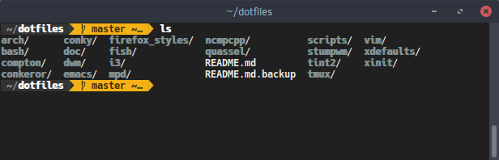
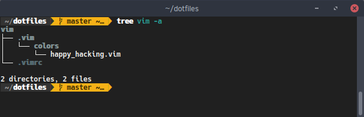
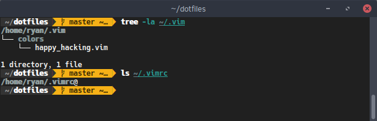

# Dotfiles
This is the new dotfile management repository for my computers (Linux). I previously maintained an older version of this repository, but over time it got cluttered and out of hand. I also did not have a great method of easily linking the files on a new system. I had to manually make symlinks. I knew there were *much* better dotfiles setups out there, but I never got around to it.

One day, after seeing [this post](http://brandon.invergo.net/news/2012-05-26-using-gnu-stow-to-manage-your-dotfiles.html), I finally decided to sit down and clean up my dotfiles directory. I wanted to re-organize it so that I could use [GNU Stow](http://freecode.com/projects/gnustow) to initialize my dotfiles. 

After setting it all up, I decided to just start from scratch with a new repository. This is that repo :).

## Using Stow and dotfiles
If you haven't read it, I would highly suggest reading the post I have linked above. But in the meantime, I can provide a quick summary of how my dotfiles are setup. 

Each application has an associated subdirectory (ex: `dotfiles/emacs`), which contains all of the dotfiles/folders associated with that application. I treat each application directory like my `~`, and fill it with my configuration files. For example, my `vim` directory has my `.vimrc`, as well as my `.vim/colors/` directory. This is so that when I use stow, it will properly place them as such in `~`.

When I setup my dotfiles on a new system, or install an application that I have dotfiles saved for, setting them up is as easy as typing:

 `stow application-dir` (ex: `stow vim`). 
 
GNU Stow then links my dotfiles under my home directory. In my vim example, this means symlinks are created for `~/.vimrc` and `~/.vim/colors/*`, pointing to their respective locations in `~/dotfiles/vim/`.

I think this setup is great, because initializing an application's directory is so simple, and I can choose to only initialize specific sub-directories. 

In the future, I might make different branches of the repository for each of my computers, so I can maintain specific configurations. In theory, I could also just make different folders (ex `vim-laptop` and `vim-server`), but I like the branch idea better because it's a little easier for me to merge changes. We shall see. 

Anyway, that's the new setup. Enjoy :-D
